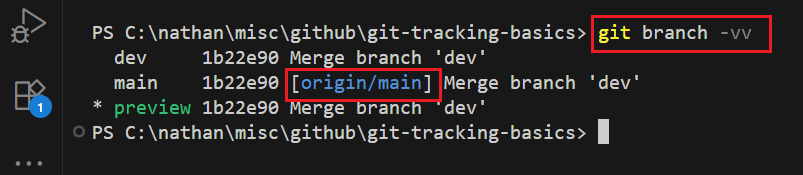

<h1>Project Name</h1>
....


<h2>Project Description</h2>
....

<h2>Motivation</h2>
In post2video i have three main branches : main , preview and dev
i want to push from dev to preview
i want to push from preview to main

i dont want to use each time origin because it is error prone , so how to do it ?
what does origin means ?

<h2>Installation</h2>
....


<h2>Usage</h2>
....


<h2>Technologies Used</h2>
<ul>
<li>Git</li>
<li>Github</li>
</ul>

<h2>Git relevant basics</h2>

<h3>What is <code>HEAD</code> in Git?</h3>

<p><code>HEAD</code> in Git is a <strong>pointer to your current commit</strong> – it shows what you're currently "looking at" or where new commits will be added.</p>


<h3>What is Tracking?</h3>

<p>In Git, <strong>tracking</strong> refers to the established relationship between a local branch in your repository and a specific branch in a remote repository.</p>

<p>Think of it as setting up a <strong>default communication channel</strong> for a particular local branch. When a local branch "tracks" a remote branch (often called its "upstream branch"), Git gains several convenient automatic behaviors:</p>
 
<h4>1. Simplified `git pull`</h4>
<p>When you're on a tracking branch and type just <code>git pull</code>, Git automatically knows which remote to fetch from and which remote branch to merge into your current local branch. You don't need to specify <code>git pull origin main</code> every time if your local <code>main</code> branch is tracking <code>origin/main</code>.</p>

<h4>2. Simplified `git push`</h4>
<p>Similarly, if your local branch is tracking a remote branch, you can often just type <code>git push</code>, and Git will automatically push your commits to the corresponding remote branch.</p>

<h4>3. Status Information</h4>
<p><code>git status</code> provides helpful information about your local branch's relationship to its tracking branch. It will tell you if your local branch is:</p>
<ul>
    <li><strong>"ahead"</strong> (you have commits not yet pushed to the remote).</li>
    <li><strong>"behind"</strong> (the remote has commits you haven't pulled yet).</li>
    <li><strong>"diverged"</strong> (both you and the remote have unique commits).</li>
    <li><strong>"up to date."</strong></li>
</ul>

<h4>How is tracking established?</h4>
<ul>
    <li><strong>Cloning a repository:</strong> When you <code>git clone</code> a repository, Git automatically sets up your local <code>main</code> (or <code>master</code>) branch to track <code>origin/main</code> (or <code>origin/master</code>).</li>
    <li><strong>Creating a new local branch from a remote branch:</strong> If you do <code>git checkout -b new-feature origin/new-feature</code>, your new <code>new-feature</code> branch will automatically track <code>origin/new-feature</code>.</li>
    <li><strong>Manually setting/changing upstream:</strong>
        <ul>
            <li>When pushing a new local branch for the first time: <code>git push -u origin my-new-branch</code> (<code>-u</code> is shorthand for <code>--set-upstream</code>).</li>
            <li>For an existing local branch: <code>git branch --set-upstream-to=origin/another-branch my-local-branch</code>.</li>
        </ul>
    </li>
</ul>

<p>In essence, tracking is about making your common Git operations (<code>pull</code>, <code>push</code>, <code>status</code>) more efficient and informative by pre-configuring the remote and remote branch your local branch is most closely associated with.</p>


<h3>What is <code>origin</code>?</h3>
<p><code>origin</code> is the default name Git gives to your remote repository (usually on GitHub). You can check it with:</p>

<pre><code>git remote -v</code></pre>
<p>Typical output:</p>
<pre><code>origin  git@github.com:yourname/post2video.git (fetch)
origin  git@github.com:yourname/post2video.git (push)
</code></pre>

<p><code>origin</code> is a property of the repository</p>

<h4>How to check origin</h4>

```bash
git remote -v
```

```bash
git remote show origin
```

<h3>What is upstream?</h3>
Upstream in Git is the primary remote repository or branch that your local repository pulls updates from and/or pushes your contributions towards. 
<p>Upstream is a property of a local branch</p>

<h4>How to check upstream</h4>

```bash
git branch -vv
```

<h3>Why <code>origin</code> is Critically Important in Git</h3>

<p>'<strong>origin</strong>' is a fundamental concept in Git, serving as the default and most common name for your <strong>main remote repository</strong>. It's not a branch, but rather an <strong>alias</strong> (a friendly nickname) that points to the web address (URL) of your project's primary shared code location, typically hosted on platforms like GitHub, GitLab, or Bitbucket.</p>

<p>Understanding <code>origin</code> is key to effective version control and collaboration. Here's why it's so important:</p>

<h4>1. The Bridge to Collaboration</h4>
<p><code>origin</code> acts as the central hub for team collaboration. Without it, your local work would be isolated.</p>
<ul>
    <li><strong>Receiving Teammates' Changes:</strong> When others push their work to the shared remote, you use commands like `git pull origin main` or `git fetch origin` to download those updates to your local repository. <code>origin</code> tells Git *where* to look for these changes.</li>
    <li><strong>Sharing Your Work:</strong> Once you've committed your own changes locally, you use <code>origin</code> to upload them for others to see and integrate. For example, `git push origin my-feature-branch` tells Git to send your local 'my-feature-branch' to the remote repository named <code>origin</code>.</li>
</ul>

<h4>2. Your Project's Central Source of Truth</h4>
<p>In most development workflows, <code>origin</code> represents the authoritative, shared version of the codebase. It's where all integrated work resides and where team members synchronize their efforts.</p>
<ul>
    <li>It ensures everyone is working from the same foundation, minimizing conflicts and maintaining consistency across the project.</li>
</ul>

<h4>3. Essential for Backup and Disaster Recovery</h4>
<p>Your local repository is on your machine, but <code>origin</code> provides a critical off-site backup. If your local drive fails or becomes corrupted, your entire project history and code are safe on <code>origin</code>.</p>
<ul>
    <li>You can easily clone the repository again from <code>origin</code> to restore your working environment: `git clone https://github.com/YourUser/YourRepo.git` (which implicitly sets up <code>origin</code>).</li>
</ul>

<h4>4. Streamlines Commands and Workflow</h4>
<p>Using <code>origin</code> as a shorthand makes Git commands more concise and intuitive.</p>
<ul>
    <li>Instead of typing the full URL (e.g., `git pull https://github.com/NathanKr/git-tracking-basics main`), you simply type `git pull origin main`. This saves time and reduces errors.</li>
    <li>It creates a consistent mental model for how local and remote repositories interact.</li>
</ul>

<h4>Analogy: Your Local Workspace vs. The Shared Company Drive</h4>
  <p>Imagine your local computer's project folder is your personal desk workspace. You're working on a document there.</p>
  <p>'<strong>origin</strong>' is like the central, shared company drive (or a cloud service like Google Drive) where the master version of the document is stored, and where everyone else on your team collaborates.</p>
  <ul>
      <li>When you `git pull origin main`, you're going to the shared drive (<code>origin</code>), getting the latest 'main' document, and bringing it to your desk.</li>
      <li>When you `git push origin my-feature-branch`, you're taking your 'my-feature-branch' document from your desk and uploading it to the shared drive (<code>origin</code>) for everyone else to see.</li>
  </ul>


  <p>Without the shared drive (<code>origin</code>), you couldn't easily collaborate or back up your work.</p>

<p>In essence, <code>origin</code> is the lifeline connecting your individual contributions to the collective project, enabling teamwork, ensuring data integrity, and simplifying your daily Git operations.</p>


<h3>Simplified Pushing with Cross-Branch Tracking</h3>
<h4>Goal</h4>
<ul>
  <li>Push from <strong>dev</strong> → <strong>preview</strong></li>
  <li>Push from <strong>preview</strong> → <strong>main</strong></li>
  <li>Configure branches to easily push to specific remote branches (even if names differ)</li>
</ul>

<h4>One-Time Setup</h4>

<h5>1. Push <code>dev</code> to <code>preview</code> with tracking</h5>
<pre><code>git checkout dev
git push --set-upstream origin dev:preview
</code></pre>
<p>Now from <code>dev</code> branch, you will need to run:</p>
<pre><code>git push origin HEAD:preview</code></pre>
<p>
    <em>Note: Although tracking is set by `--set-upstream`, if your local branch name (e.g., `dev`) does not match the remote branch name it's tracking (e.g., `preview`), Git's default `push.default` setting may require the explicit `git push origin HEAD:&lt;remote-branch-name&gt;` command.</em>
</p>

<h5>2. Push <code>preview</code> to <code>main</code> with tracking</h5>
<pre><code>git checkout preview
git push --set-upstream origin preview:main
</code></pre>
<p>Now from <code>preview</code> branch, you will need to run:</p>
<pre><code>git push origin HEAD:main</code></pre>
<p>
    <em>(This note applies here as well, where `preview` does not match `main`.)</em>
</p>


<h4>Summary</h4>
<table border="1" cellpadding="6">
  <thead>
    <tr>
      <th>Local Branch</th>
      <th>Push Target</th>
      <th>Setup Command</th>
      <th>Future Command</th>
    </tr>
  </thead>
  <tbody>
    <tr>
      <td><code>dev</code></td>
      <td><code>preview</code></td>
      <td><code>git push --set-upstream origin dev:preview</code></td>
      <td><code>git push origin HEAD:preview</code></td>
    </tr>
    <tr>
      <td><code>preview</code></td>
      <td><code>main</code></td>
      <td><code>git push --set-upstream origin preview:main</code></td>
      <td><code>git push origin HEAD:main</code></td>
    </tr>
  </tbody>
</table>


<h2>Demo</h2>

<h3>branch created<h3>

dev :


preview :


<h3>upstream</h3>

You can see here that only main branch has upstream which is origin/main


This means that on main you can do 

```bash
git pull
git push
```

and git will know where to look for the info i.e. origin/main

<h3>set main remote as upstream for preview</h3>


<h3>set preview remote as upstream for dev</h3>


<h3>ahead</h3>

Notice that dev is ahead by 1 relative to its remote upstram - preview. To solve this you simple need to push from dev to Head:preview , once done the ahead is gone


Notice that main is behine its remote upstream


<h2>Points of Interest</h2>
<ul>
  <li>why

    ```bash
    git push origin preview
    ```
    issued pull request from preview to main
  </li>

  <li>1) why after i have set main as upstream for preview , so from preview i did git push i got
git push
fatal: The upstream branch of your current branch does not match
the name of your current branch.  To push to the upstream branch

    git push origin HEAD:main

To push to the branch of the same name on the remote, use

    git push origin HEAD

To choose either option permanently, see push.default in 'git help config'.

To avoid automatically configuring an upstream branch when its name
won't match the local branch, see option 'simple' of branch.autoSetupMerge
in 'git help config'.

2) and then 
git push origin main
To https://github.com/NathanKr/git-tracking-basics
 ! [rejected]        main -> main (non-fast-forward)
error: failed to push some refs to 'https://github.com/NathanKr/git-tracking-basics'
hint: Updates were rejected because a pushed branch tip is behind its remote
hint: counterpart. If you want to integrate the remote changes, use 'git pull'
hint: before pushing again.
hint: See the 'Note about fast-forwards' in 'git push --help' for details.

3) only  this is ok git push origin HEAD:main
Total 0 (delta 0), reused 0 (delta 0), pack-reused 0
To https://github.com/NathanKr/git-tracking-basics
   7b9308e..bf5becd  HEAD -> main
PS C:\nathan\misc\github\git-tracking-basics>
  </li>
  <li>suppose that i have create main as upstream for preview now i push - will it reach both main and preview on remote</li>
  <li>on preview after set upstream as main i did 
  
  push origin HEAD:main
  but on the remote preview was begine so i had to do also
  git push origin preview 

  ==>do i always need to do this ?
  
  </li>

</ul>

<h2>References</h2>
<ul>
    <li>...</li>
   
</ul>

