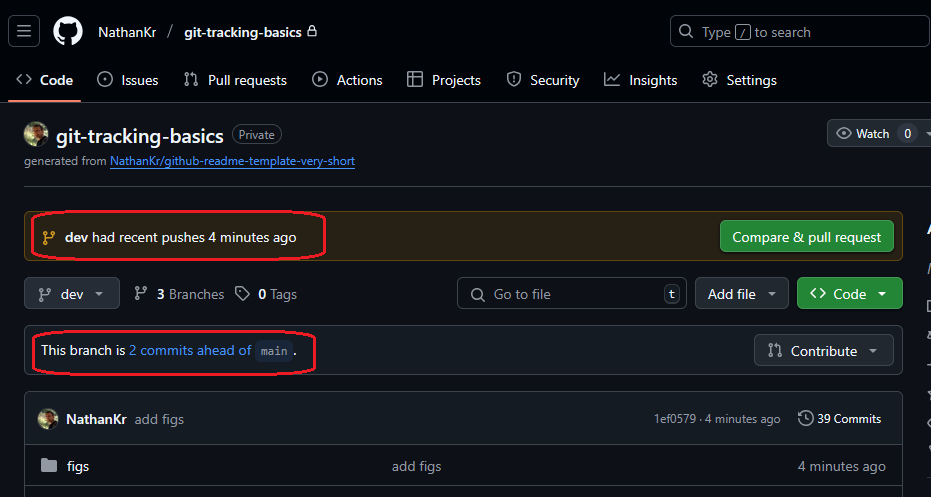

<h1>Project Name</h1>
Git Tracking Basics for CI/CD Workflows

<h2>Project Description</h2>
<p>This repository serves as a practical guide and hands-on demonstration for mastering essential Git concepts, focusing specifically on branch tracking, the role of <code>origin</code>, and upstream relationships. It illustrates how these fundamental Git features streamline development workflows, particularly within a Continuous Integration/Continuous Delivery (CI/CD) environment through a clear <code>dev</code> &rarr; <code>preview</code> &rarr; <code>main</code> branching strategy.</p>


<h2>Motivation</h2>
<p>This project employs a structured Git branching strategy to manage releases across different environments. The primary goal is to ensure stable code progression from development through testing to production. Specifically, we follow a <code>dev</code> &rarr; <code>preview</code> &rarr; <code>main</code> flow.</p>
<p>A key aim is to streamline Git operations within this flow, minimizing manual specification of remotes and branches (e.g., avoiding <code>git push origin dev</code> every time) by leveraging Git's upstream tracking features. This enhances efficiency and reduces potential errors during code promotion.</p>


<h2>Installation</h2>
<p>To get started with this guide and follow the practical examples, you only need Git installed on your system. No other complex dependencies are required.</p>
<ol>
    <li><strong>Clone the repository:</strong> Open your terminal or command prompt and run the following command to clone this repository to your local machine:
        <pre><code>git clone https://github.com/NathanKr/git-tracking-basics</code></pre>
    </li>
    <li><strong>Navigate into the project directory:</strong>
        <pre><code>cd git-tracking-basics</code></pre>
    </li>
</ol>

<h2>Usage</h2>
<p>This repository is designed as an educational resource and a hands-on guide. To make the most of it:</p>
<ol>
    <li><strong>Read the README:</strong> Start by thoroughly reading this <code>README.md</code> file from top to bottom. It provides comprehensive explanations of all key Git concepts and the branching strategy.</li>
    <li><strong>Explore the Demo:</strong> The "Demo" section highlights important Git commands and their visual outcomes. We encourage you to execute these commands in your own cloned repository to observe and understand the results directly. This hands-on practice will solidify your understanding.</li>
    <li><strong>Experiment:</strong> Feel free to experiment with Git commands, create new branches, make commits, and explore different scenarios within your local clone to deepen your knowledge.</li>
</ol>


<h2>Technologies Used</h2>
<ul>
<li>Git</li>
<li>GitHub</li>
</ul>

<h2>Git tracking basics</h2>

<h3>What is a Branch in Git?</h3>
<p>A <strong>branch</strong> in Git is a lightweight, movable pointer to a commit. It serves as a <strong>separate track or timeline for changes</strong> within your repository. This allows you to work on new features, bug fixes, or prepare for different deployment stages (like <code>dev</code>, <code>preview</code>, or <code>main</code>) without interfering with the integrity of other branches.</p>


<h3>Local vs. Remote Branches</h3>
<p>When working with Git, it's essential to distinguish between branches that exist on your local machine and those that reside on a remote server (like GitHub).</p>

<h4>Local Branch</h4>
<p>A <strong>local branch</strong> is a branch that exists only in your local Git repository on your computer. You create, commit to, and manage these branches directly on your machine. Changes made on a local branch are not visible to others or on the remote repository until you explicitly "push" them.</p>

<h4>Remote Branch</h4>
<p>A <strong>remote branch</strong> (often referred to with a prefix like <code>origin/</code>, e.g., <code>origin/main</code> or <code>origin/dev</code>) represents the state of a branch on a remote Git repository. These branches are what other collaborators push their changes to and pull updates from. You cannot directly check out or commit to a "remote branch" in the same way you would a local one. Instead, your local repository maintains references to these remote branches, known as "remote-tracking branches."</p>

<h4>Remote-Tracking Branch</h4>
<p>A <strong>remote-tracking branch</strong> (e.g., <code>origin/main</code>) is a local reference that acts as a bookmark for the last known state of a remote branch. Git updates these references whenever you communicate with the remote (e.g., using <code>git fetch</code>, <code>git pull</code>, or <code>git push</code>). They show you where the remote branch was at your last synchronization point and are crucial for determining if your local branch is "ahead" or "behind" the remote.</p>

<p>In essence, you work on your <strong>local branches</strong>, and then synchronize your changes with the <strong>remote branches</strong> (via their <strong>remote-tracking branch</strong> counterparts) on the shared server.</p>


<h3>What is <code>HEAD</code> in Git?</h3>

<p><code>HEAD</code> in Git is a <strong>pointer to your current commit</strong> – it shows what you're currently "looking at" or where new commits will be added.</p>

<h3>What is Tracking?</h3>

<p>In Git, <strong>tracking</strong> refers to the established relationship between a local branch in your repository and a specific branch in a remote repository.</p>

<p>Think of it as setting up a <strong>default communication channel</strong> for a particular local branch. When a local branch "tracks" a remote branch (often called its "upstream branch"), Git gains several convenient automatic behaviors:</p>
 
<h4>1. Simplified `git pull`</h4>
<p>When you're on a tracking branch and type just <code>git pull</code>, Git automatically knows which remote to fetch from and which remote branch to merge into your current local branch. You don't need to specify <code>git pull origin main</code> every time if your local <code>main</code> branch is tracking <code>origin/main</code>.</p>

<h4>2. Simplified `git push`</h4>
<p>Similarly, if your local branch is tracking a remote branch, you can often just type <code>git push</code>, and Git will automatically push your commits to the corresponding remote branch.</p>

<h4>3. Status Information</h4>
<p><code>git status</code> provides helpful information about your local branch's relationship to its tracking branch. It will tell you if your local branch is:</p>
<ul>
    <li><strong>"ahead"</strong> (you have commits not yet pushed to the remote).</li>
    <li><strong>"behind"</strong> (the remote has commits you haven't pulled yet).</li>
    <li><strong>"diverged"</strong> (both you and the remote have unique commits).</li>
    <li><strong>"up to date."</strong></li>
</ul>

<h4>How is Tracking Established?</h4>
<ul>
    <li><strong>Cloning a repository:</strong> When you <code>git clone</code> a repository, Git automatically sets up your local <code>main</code> (or <code>master</code>) branch to track <code>origin/main</code> (or <code>origin/master</code>).</li>
    <li><strong>Creating a new local branch from a remote branch:</strong> If you do <code>git checkout -b new-feature origin/new-feature</code>, your new <code>new-feature</code> branch will automatically track <code>origin/new-feature</code>.</li>
    <li><strong>Manually setting/changing upstream:</strong>
        <ul>
            <li>When pushing a new local branch for the first time: <code>git push -u origin my-new-branch</code> (<code>-u</code> is shorthand for <code>--set-upstream</code>).</li>
            <li>For an existing local branch: <code>git branch --set-upstream-to=origin/another-branch my-local-branch</code>.</li>
        </ul>
    </li>
</ul>

<p>In essence, tracking is about making your common Git operations (<code>pull</code>, <code>push</code>, <code>status</code>) more efficient and informative by pre-configuring the remote and remote branch your local branch is most closely associated with.</p>

<h3>Understanding <code>origin</code> and Upstream</h3>
<p><code>origin</code> is a fundamental concept in Git, serving as the default and most common name for your <strong>main remote repository</strong>. It's not a branch, but rather an <strong>alias</strong> (a friendly nickname) that points to the web address (URL) of your project's primary shared code location, typically hosted on platforms like GitHub, GitLab, or Bitbucket.</p>

<p>Understanding <code>origin</code> is key to effective version control and collaboration. Here's why it's so important:</p>

<h4>1. The Bridge to Collaboration</h4>
<p><code>origin</code> acts as the central hub for team collaboration. Without it, your local work would be isolated.</p>
<ul>
    <li><strong>Receiving Teammates' Changes:</strong> When others push their work to the shared remote, you use commands like `git pull origin main` or `git fetch origin` to download those updates to your local repository. <code>origin</code> tells Git *where* to look for these changes.</li>
    <li><strong>Sharing Your Work:</strong> Once you've committed your own changes locally, you use <code>origin</code> to upload them for others to see and integrate. For example, `git push origin my-feature-branch` tells Git to send your local 'my-feature-branch' to the remote repository named <code>origin</code>.</li>
</ul>

<h4>2. Your Project's Central Source of Truth</h4>
<p>In most development workflows, <code>origin</code> represents the authoritative, shared version of the codebase. It's where all integrated work resides and where team members synchronize their efforts.</p>
<ul>
    <li>It ensures everyone is working from the same foundation, minimizing conflicts and maintaining consistency across the project.</li>
</ul>

<h4>3. Essential for Backup and Disaster Recovery</h4>
<p>Your local repository is on your machine, but <code>origin</code> provides a critical off-site backup. If your local drive fails or becomes corrupted, your entire project history and code are safe on <code>origin</code>.</p>
<ul>
    <li>You can easily clone the repository again from <code>origin</code> to restore your working environment: `git clone https://github.com/YourUser/YourRepo.git` (which implicitly sets up <code>origin</code>).</li>
</ul>

<h4>4. Streamlines Commands and Workflow</h4>
<p>Using <code>origin</code> as a shorthand makes Git commands more concise and intuitive.</p>
<ul>
    <li>Instead of typing the full URL (e.g., `git pull https://github.com/NathanKr/git-tracking-basics main`), you simply type `git pull origin main`. This saves time and reduces errors.</li>
    <li>It creates a consistent mental model for how local and remote repositories interact.</li>
</ul>

<h4>Analogy: Your Local Workspace vs. The Shared Company Drive</h4>
<p>Imagine your local computer's project folder is your personal desk workspace. You're working on a document there.</p>
<p>'<strong>origin</strong>' is like the central, shared company drive (or a cloud service like Google Drive) where the master version of the document is stored, and where everyone else on your team collaborates.</p>
<ul>
    <li>When you `git pull origin main`, you're going to the shared drive (<code>origin</code>), getting the latest 'main' document, and bringing it to your desk.</li>
    <li>When you `git push origin my-feature-branch`, you're taking your 'my-feature-branch' document from your desk and uploading it to the shared drive (<code>origin</code>) for everyone else to see.</li>
</ul>

<p>In essence, <code>origin</code> is the lifeline connecting your individual contributions to the collective project, enabling teamwork, ensuring data integrity, and simplifying your daily Git operations.</p>

<p>As discussed above, the **upstream** (or tracking) branch is the specific remote branch that your local branch is configured to pull updates from and push changes to by default. It defines the default remote target for commands like <code>git pull</code> and <code>git push</code> when executed without explicit remote or branch names. An upstream is a property of a <b>local branch</b>.</p>

<h4>How to check <code>origin</code> and Upstream</h4>
<p>To see your configured remotes (like <code>origin</code>):</p>
<pre><code>git remote -v</code></pre>
<p>Typical output:</p>
<pre><code>origin  git@github.com:yourname/post2video.git (fetch)
origin  git@github.com:yourname/post2video.git (push)
</code></pre>
<p>To see your local branches and what upstream branch they are tracking:</p>
<pre><code>git branch -vv</code></pre>


<h2>Design - Branching Strategy</h2>
<p>
  This strategy uses a <b><code>dev</code> &rarr; <code>preview</code> &rarr; <code>main</code></b> flow, establishing clear stages for code stability: <code>dev</code> for active work, <code>preview</code> for testing and QA, and <code>main</code> for production.
</p>
<p>
  It <b>reduces the risk of bugs</b> in live environments by requiring code to pass through validation points. While it adds some merging overhead and branch management compared to simpler models, it's excellent for projects needing <b>structured quality control and predictable releases</b>.
</p>

<h3>Flow</h3>
<p><code>dev</code> &rarr; <code>preview</code> &rarr; <code>main</code></p>

<h3>Upstream Configuration (One-Time Setup)</h3>
<p>To enable simple <code>git push</code> and <code>git pull</code> commands without specifying <code>origin</code> or branch names, ensure your local branches are tracking their corresponding remote branches. This is the standard way Git simplifies interactions with the remote.</p>
<ul>
    <li><code>dev</code> local branch should track <code>origin/dev</code>.
        <pre><code>git checkout dev
git branch --set-upstream-to=origin/dev dev
</code></pre>
    </li>
    <li><code>preview</code> local branch should track <code>origin/preview</code>.
        <pre><code>git checkout preview
git branch --set-upstream-to=origin/preview preview
</code></pre>
    </li>
    <li><code>main</code> local branch should track <code>origin/main</code>. (This is often set by default when cloning, no <code>set-upstream</code> typically needed
    </li>
</ul>
<p>
    <em>You can verify tracking status for all your local branches with: <code>git branch -vv</code></em>
</p>

<h3>Merging and Pushing Workflow</h3>
<p>This is how you promote changes from one stage to the next. You merge the source branch into the target branch, then push the <i>target</i> branch to its corresponding remote.</p>

<h4>1. Promote from <code>dev</code> to <code>preview</code></h4>
<p>This process brings the latest changes from <code>dev</code> into the <code>preview</code> branch, ready for testing in the <code>preview</code> environment.</p>
<pre><code>git checkout preview    # Switch to the target branch (preview)
git pull                # Get the latest changes from origin/preview
git merge dev           # Merge changes from the dev branch into preview
# Resolve any merge conflicts if they occur
git push                # Push the updated preview branch to origin/preview
</code></pre>

<h4>2. Promote from <code>preview</code> to <code>main</code></h4>
<p>Once changes in <code>preview</code> are stable and approved, this process brings them into the <code>main</code> branch for production deployment.</p>
<pre><code>git checkout main       # Switch to the target branch (main)
git pull                # Get the latest changes from origin/main
git merge preview       # Merge changes from the preview branch into main
# Resolve any merge conflicts if they occur
git push                # Push the updated main branch to origin/main
</code></pre>

<h2>Demo</h2>

<h3>Branch Creation</h3>

dev :


preview :


<h3>Viewing Upstream Status</h3>

You can see here that only main branch has upstream which is origin/main


This means that on main you can do

```bash
git pull
git push
```

and git will know where to look for the info i.e. origin/main

<h3>Setting Upstream Branches</h3>
       
The following steps demonstrate setting the upstream for dev


The following steps demonstrate setting the upstream for preview


Now, all branches have their upstream configured


<h3>GitHub Dashboard: Ahead/Behind Status</h3>


click on it


we can see that dev is ahead of main



<h3>Merging Changes Between Branches</h3>

following changes in dev you might want the preview branch to accept it


<h2>Points of Interest</h2>
<ul>
    <li>While <code>git branch -vv</code> provides the behind/ahead status of a local branch relative to its configured upstream (e.g., <code>dev</code> compared to <code>origin/dev</code>), the GitHub dashboard's "Branches" tab displays this status for <strong>each remote branch (as it exists on GitHub)</strong> relative to the repository's <em>default branch</em> (typically <code>main</code> or <code>master</code>).</li>
    <li>It is crucial to use <code>git status</code>, as it reveals essential information about the working directory and staging area that is not provided by <code>git branch -vv</code> or the GitHub dashboard's branch tags.</li>
</ul>


